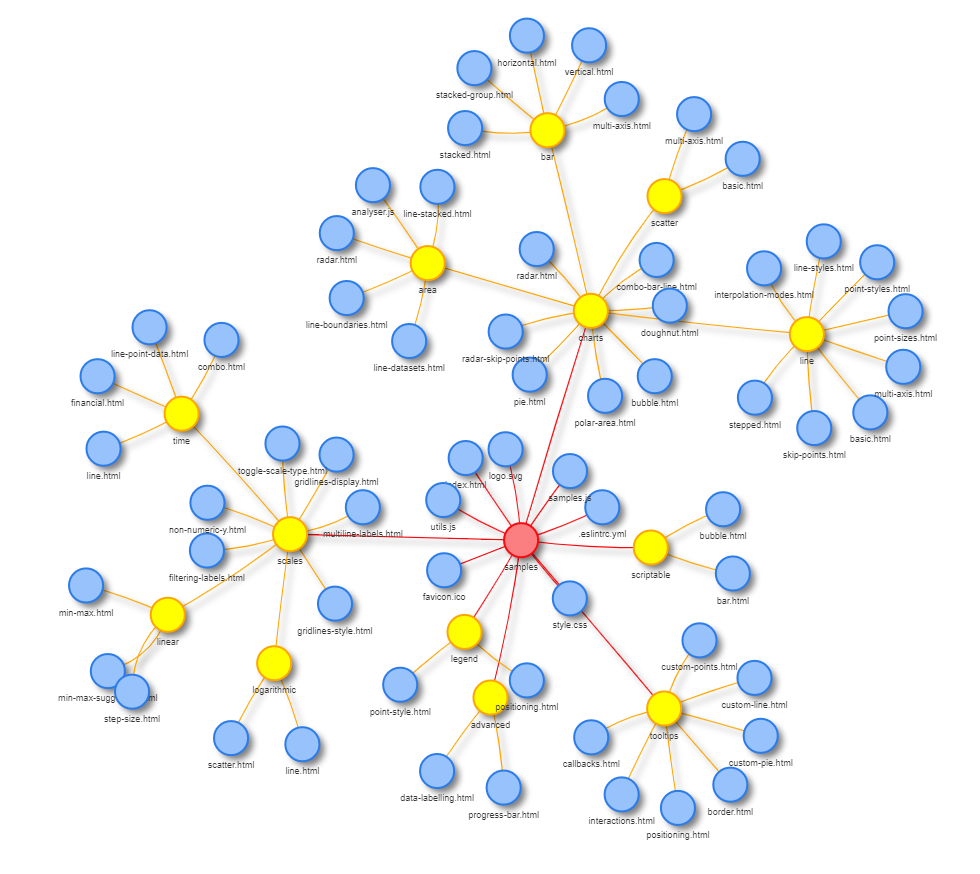

# Tree

A simple visualizer for file directory tree structures, especially in Windows. Files and folders are visualized as a network, with files and the directories they belong to connected. This can be useful for quickly seeing the structure of all a project's files or just creating a visualization for fun.

*Visualization of the [`samples`](https://github.com/chartjs/Chart.js/tree/master/samples) directory of the [Chart.js](https://www.chartjs.org/) library*

# Usage

A demo of the program is available here: https://generic-github-user.github.io/Tree/src/. Before using the program, you will need to create a list of files in your chosen directory. Below are instructions to do so - they should remain firly relevant, as the command line has not changed much in the last 20 years. For more information, see [this question](https://stackoverflow.com/questions/15214486/command-to-list-all-files-in-a-folder-as-well-as-sub-folders-in-windows) on StackOverflow.

## Generating a list of files

First, open up the command prompt. On Windows, just press the Windows button in the lower left-hand corner of the screen and search for "cmd".

Next, navigate to the directory you want to visualize with `cd C:\Your\Directory\Path`.

Once you're in the correct directory, enter `dir /s/b > dir.txt`. This will create a list of only the file paths of each file in the directory and files in the directory's subfolders, then alphabetize it and save it to a text file called `dir.txt`.

You can close the command prompt now. Navigate to the directory in Windows Explorer or a similar program and open the text file.

Use `CTRL + A` to select all of the text inside the document, then `CTRL + C` to copy it to your clipboard.

Once you have the list of file paths, just paste it (`CTRL + V`) into the text box and press the "Update" button. The network visualization will automatically be generated. Enjoy!

## Running it locally

If you so desire, you can also run a local clone of the program, although there is no good reason to. The demo version is perfectly good. One quick note: to include the default file maps, you will need to run the program on a local server so that an AJAX call can be made to request the needed data from the text file. The [atom-live-server package](https://atom.io/packages/atom-live-server) for the [Atom](https://atom.io/) text editor works well for this purpose. If not run on a live server, an error will be thrown.

# Tools

## vis.js
http://visjs.org/

The bread and butter of this project. vis.js is used to create the pretty network visualizations and pretty much does all the work for me. It can also do other stuff, like graphs. If you're making graphs though, use [Chart.js](https://getmdl.io/).

## Material Design Lite
https://getmdl.io/

Partly because I wanted the text box to look good and partly because normal CSS isn't already painful enough.

## jQuery
https://jquery.com/

Because it's jQuery.

# Notes

 - If you want to visualize GitHub repositories, see veniversum's wonderful [git-visualizer](https://github.com/veniversum/git-visualizer). It works quite similar to Tree, but with GitHub repositories instead of files and folders.
